<!DOCTYPE html>
<html lang="en">
<head>
    <meta charset="UTF-8">
    <meta name="viewport" content="width=device-width, initial-scale=1.0">
    <title>Rapport</title>

</head>
<body>
<h1>Activité Pratique N°2 - ORM JDBC JPA Hibernate  Spring Data</h1>
<h2>Introduction</h2>

Dans ce rapport je décris les étapes pour la création d'un
projet Spring Initializer de gestion de patients à patir d'une base de données H2
et aussi une base de données mysql

<h3>1. Installer IntelliJ Ultimate</h3>
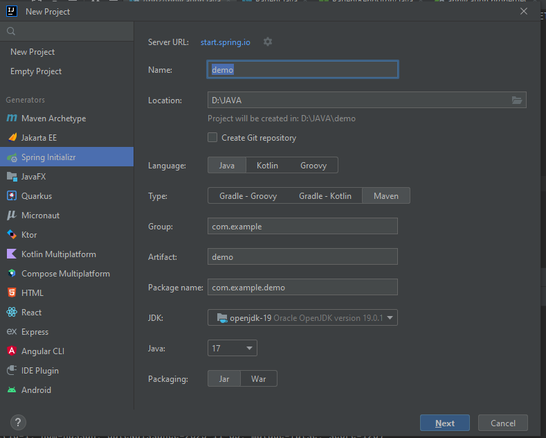

IntelliJ IDEA est un environnement de développement intégré (IDE) écrit en Java pour développer des logiciels informatiques écrits en Java, Kotlin, Groovy et d'autres langages basés sur JVM.

<h3>2. Créer un projet Spring Initializer avec les dépendances JPA, H2, Spring Web et Lombock</h3>
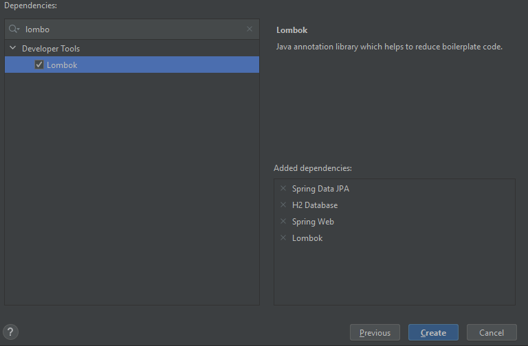
<h3>3.Créer l'entité JPA Patient ayant les attributs :  
       - id de type Long   
       - nom de type String  
       - dateNaissanec de type Date  
       - malade de type boolean  
       - score de type int</h3>
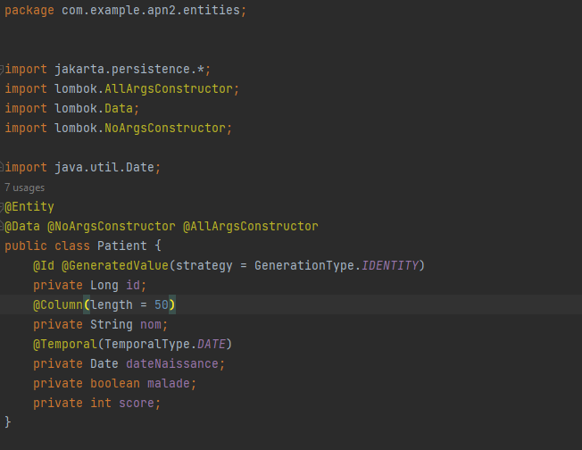

Ce code est une classe d'entité Java pour un "Patient" dans une application Java qui utilise JPA (Java Persistence API). Cette classe représente une entité patient et est annotée avec des annotations JPA pour la persistance dans une base de données. Voici une explication des annotations et des champs utilisés dans le code :

1. `@Entity` : Cette annotation marque la classe en tant qu'entité JPA, indiquant que les instances de cette classe seront mappées sur une table de base de données correspondante.

2. `@Data`, `@NoArgsConstructor`, `@AllArgsConstructor` : Ces annotations proviennent de la bibliothèque Lombok et aident à réduire le code redondant. `@Data` génère les méthodes getters, setters, `equals()`, `hashCode()` et `toString()`. `@NoArgsConstructor` génère un constructeur sans argument, et `@AllArgsConstructor` génère un constructeur avec tous les champs en tant qu'arguments.

3. `@Id` : Cette annotation est utilisée pour spécifier que le champ `id` est la clé primaire de l'entité.

4. `@GeneratedValue` : Cette annotation est utilisée en conjonction avec `@Id` pour spécifier comment les valeurs de la clé primaire sont générées. Dans ce cas, `GenerationType.IDENTITY` indique que la base de données générera automatiquement des identifiants uniques pour chaque nouveau enregistrement.

5. `@Column` : Cette annotation est utilisée pour spécifier la correspondance du champ `nom` avec une colonne de la base de données. Dans ce cas, elle précise que la colonne devrait avoir une longueur de 50 caractères.

6. `@Temporal` : Cette annotation est utilisée pour spécifier la correspondance du champ `dateNaissance` avec un type de date de la base de données.

7. `private Long id` : Ce champ représente la clé primaire de l'entité.

8. `private String nom` : Ce champ représente le nom du patient.

9. `private Date dateNaissance` : Ce champ représente la date de naissance du patient. Il est annoté avec `@Temporal` pour spécifier sa correspondance avec un type de date.

10. `private boolean malade` : Ce champ représente si le patient est malade ou non.

11. `private int score` : Ce champ représente un score associé au patient.

Cette classe est une entité JPA standard qui peut être utilisée pour interagir avec une base de données. Vous pouvez effectuer des opérations CRUD (Create, Read, Update, Delete) sur les objets `Patient` à l'aide de JPA et d'une base de données compatible.

<h3>4. Configurer l'unité de persistance dans le ficher application.properties</h3>
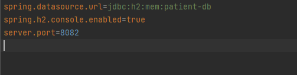
<h3>5. Créer l'interface JPA Repository basée sur Spring data</h3>
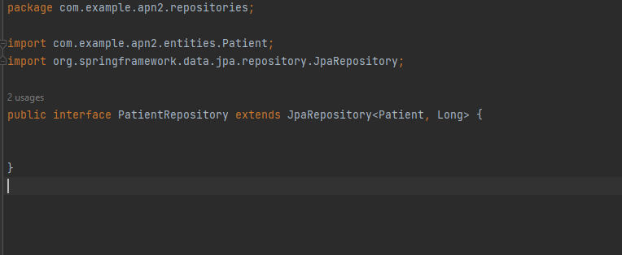
Ce code est une interface de référentiel (repository) utilisée dans une application Spring Boot pour gérer les opérations de persistance des entités `Patient` dans une base de données. Voici une explication de cette interface :

1. `PatientRepository` étend `JpaRepository<Patient, Long>` : Cette interface étend `JpaRepository`, qui est une interface générique fournie par Spring Data JPA pour effectuer des opérations de base de données sur l'entité `Patient`. Elle prend deux paramètres de type générique : `Patient` (l'entité avec laquelle vous travaillez) et `Long` (le type de la clé primaire de l'entité).

2. `List<Patient> findByMalade(boolean malade, Pageable pageable)` : Cette méthode déclare une requête personnalisée pour rechercher des patients en fonction de leur état de santé (malade ou non). Elle prend deux paramètres : `malade` (un booléen indiquant si le patient est malade ou non) et `pageable` (une interface qui peut être utilisée pour spécifier des informations de pagination, comme le numéro de page et la taille de la page). La méthode renverra une liste de patients en fonction des critères donnés.

3. `List<Patient> findByMaladeAndScoreLessThan(boolean m, int score)` : Cette méthode déclare une autre requête personnalisée pour rechercher des patients en fonction de deux critères : l'état de santé (`malade`) et un score inférieur à une valeur donnée (`score`). Elle renverra une liste de patients correspondant aux critères spécifiés.

Ces méthodes personnalisées sont générées automatiquement par Spring Data JPA en fonction des noms des méthodes définies dans l'interface, en utilisant la convention de nommage. Vous pouvez les utiliser pour effectuer des opérations de recherche spécifiques sur les entités `Patient` sans avoir à écrire les requêtes SQL correspondantes manuellement.

<h3>6. Tester quelques opérations de gestion de patients :</h3>
<h3>- Ajouter des patients
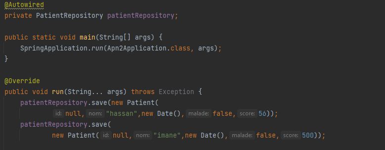
- Consulter tous les patients
  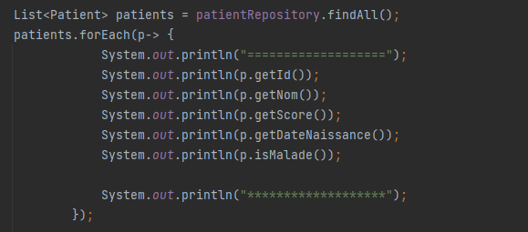
- Consulter un patient
- Chercher des patients
  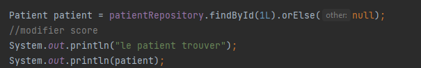

- Mettre à jour un patient
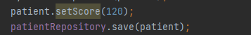
 
- supprimer un patient 
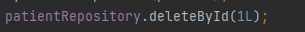

<h3>7. Migrer de H2 Database vers MySQL</h3>
fichier dependences :
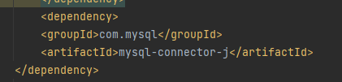
fichier applications.propretites :
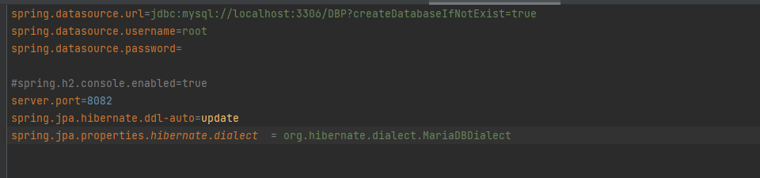

</body>
</html>